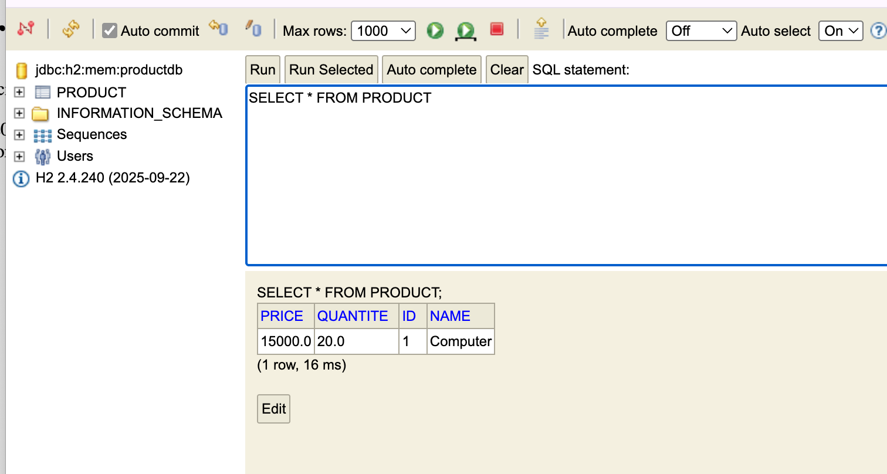
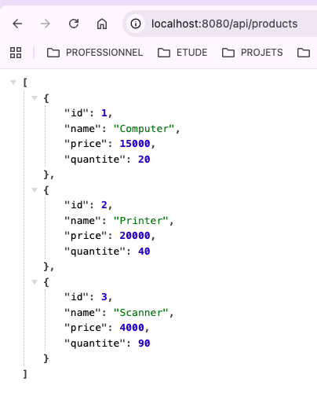
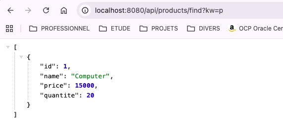
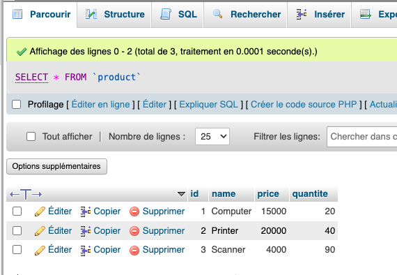
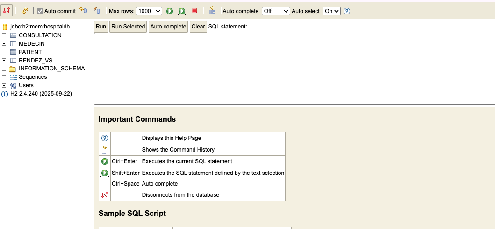
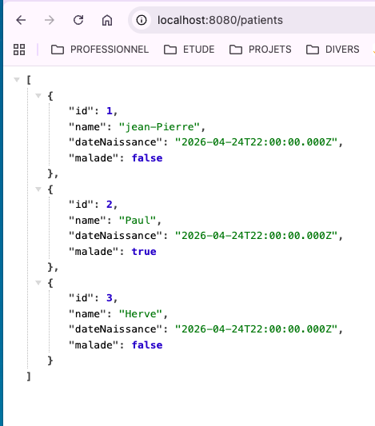
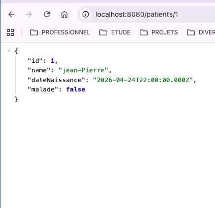
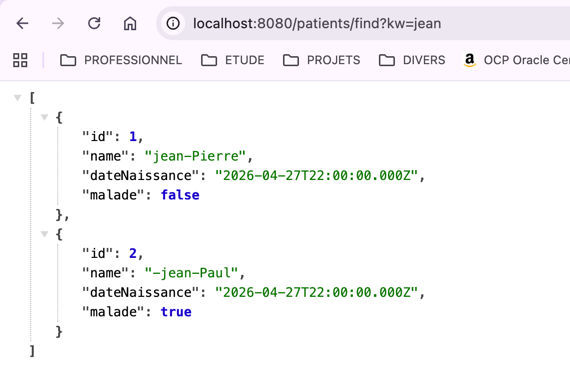

# Project Spring Boot de Gestion de Produit avec Spring Data JPA

- Ajouter des produits
- Consulter tous les produits
- Consulter un produit
- Chercher des produits
- Mettre à jour un produit
- supprimer un produit

Spring Boot-Spring Data-Spring Data JPA-H2-MySQL
<h1>  </h1> 

- Consulter tous les produits

- Remplacement base de données MySQL**

<h1>  Projet Hostpital - Gestion des patients et des rendeez </h1> 
un dans le même projet BDCC, un sous-projet/module est crée pour gérer les patients et rendez-vous

- Création de la base de donné mémoire H2
  
- Liste des patients

- rechercher le patien d'id 1

- Rechercher un patinet dont le contien le mot clé jean 

